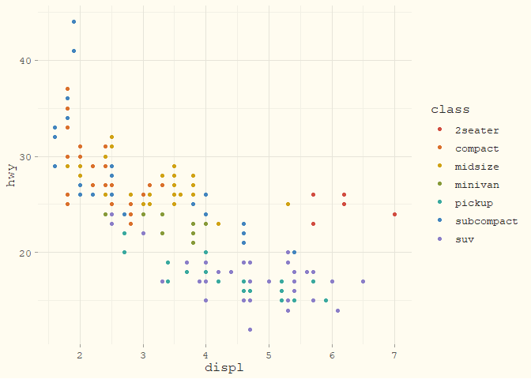

<!-- README.md is generated from README.Rmd. Please edit that file -->

# flexoki 

<!-- badges: start -->

[](https://github.com/christopherkenny/flexoki/actions/workflows/R-CMD-check.yaml)
<!-- badges: end -->

`flexoki` provides a set of color palettes from Steph Ango’s
<https://stephango.com/flexoki>.

This package provides:

- Dark and light [`ggplot2`](https://ggplot2.tidyverse.org/index.html)
  themes that match the aesthetic of Flexoki’s code editor styles.
- Custom color and fill scales for discrete, continuous, and binned data
  using Flexoki’s extended color schemes.
- Color palettes in the `flexoki` object, which is a list of
  [`palette`](https://christophertkenny.com/palette/) vectors.

## Installation

You can install the development version of `flexoki` from
[GitHub](https://github.com/christopherkenny/flexoki) with:

``` r
pak::pak('christopherkenny/flexoki')
```

## Example

`flexoki` provides basic ggplot2 scales for fill and color (also aliased
as colour). It similarly provides corresponding theme functions.

``` r
library(ggplot2)
library(flexoki)

mpg |>
  ggplot() +
  geom_point(aes(displ, hwy, colour = class)) +
  scale_color_flexoki_d(palette = 'light') +
  theme_flexoki_light()
```


